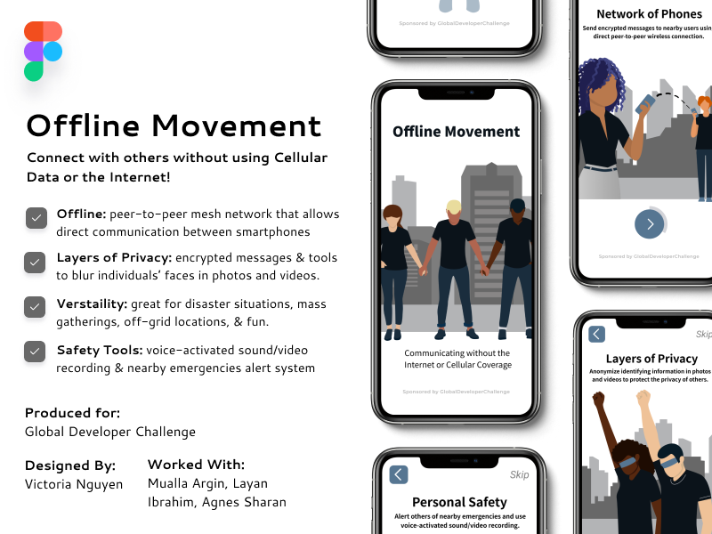
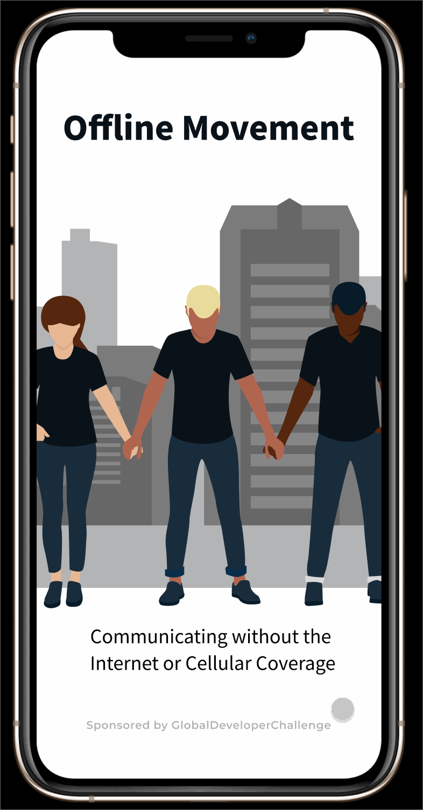

# Offline Movement :iphone:

Offline Movement is a phone application that allows users to connect to others without using Cellular Data or the Internet.  This Offline Messaging feature is secured by a peer-to-peer mesh network (Bluetooth) that allows for direct communication between smartphones.To enforce privacy the app includes encrypted messages and tools to blur individuals' faces in photos and vidoes. In order to ensure safety the app has a voice-activated video recording system installed. Offline Movement is a savior during disaster situations and mass gatherings.

## Vision & Inspiration

As protests against police brutality have swept across the nation following George Floyd's Death, Protestors are looking for apps to ensure their safety. In order to guarantee the safety of friends and family going out to protest we looked into existing apps and we came upon the Firechat Offline Messaging App. Firechat uses a peer-to peer mesh network allows users in close proximity (400-500ft) to message each other without cellular data or the Internet. It inspired us to develop an app used in case of disaster situations and mass gatherings. Users may contact nearby individuals for help without cellular data or the Internet. Additionaly they may use voice activated features (code-words) to enable voice activated video or voice recording if they're enduring abuse or violence and cannot physically turn on their phone's camera. Finally, to guarantee that their cellular device is not used against them, a voice activated shut-down feature will also be implemented.

## How we built it
1. Design UI/UX
2. Code UI/UX in Android Studio
2. Secure peer to peer mesh network (Offline Messaging) with Bridgefy SDK in Android Studio
3. Add Android Studio Voice Capabilities to allow for Voice Activated Commands
4. Utilize OpenCV SDK for facial recognition tech to blur individuals’ faces in photos and video messages in Android Studio

## Challenges We Ran Into
* Bridgefy is a developer-friendly SDK that can be  integrated into Android and iOS apps(including messaging apps) to make them work without the Internet. However, when this SDK was implemented into our app we noticed that many of the methods Bridgefy SDK used have been deprecated.This may be due to the fact that the last update to the repository was 12 months ago. We attempted to replace those methods with newer versions of the methods however some methods no longer had replacements so we were unable to implement the SDK like we wanted to.Additionally, many of us are better equipped in python and web development and know less about app development. We were unable to go into IOS app development and test the IOS Bridgefy SDK because not all members of the team owned a Mac.

* Our team faced difficulties in communicating with each other due to time zone differences.With the timezone difference, some of us had to compromise by sacrificing our sleeping schedules.In addition, sometimes the internet connection sucks.However, we did not want time zone differences, sleep deprivation and a bad internet connection to hold us back from participating in Global Developer Challenge 2020.

## Accomplishments We are Proud of 
* Utilizing the knowledge we gained from the workshops to create our application 
* Being able to work together and produce something despite our major time zone differences and limited time.
* Being able to bring all of our unique educational backgrounds to produce a product.
* Learning that this is a novel idea that others have not created before.

## What we learned
We learned how to use Android Studio for the first time, and how to work together with different skill sets. In addition, we learned that many tools like Bridgefy SDK and OPENCV SDK exist that can be used to make our app a reality.

## Built With

* [Bridgefy SDK](https://github.com/bridgefy) - SDK used to set up offline messaging
* [Android Studio](https://developer.android.com/studio) - Developing App
* [Figma](https://www.figma.com/file/lYxk53Du04z3y3wJmFcSzx/Offline-Movement) - Designing UI/UX 
* [OpenCV-SDK](https://opencv.org/android/) - Facial Recognition for Face-Blur
* [Java](https://www.java.com/en/) - Coding Language

## Getting Started/Set Up Guide
1. In Github click the "Clone or download" button of the project you want to import --> download the ZIP file and unzip it. In Android Studio Go to File -> New Project -> Import Project and select the newly unzipped folder -> press OK
2. In Android Studio, create an Android Virtual Device (AVD) that the emulator can use to install and run your app.-->In the toolbar, select the AVD that you want to run your app on from the target device drop-down menu.Click Run. OR Use Android Device. On the device, open the Settings app, select Developer options, and then enable USB debugging.

## App Demo

## Authors

* **Mualla Argin** - *App Development: Back: Full Stack Development | College sophomore in Computer Science* - [margin25](https://github.com/margin25)
* **Victoria Nguyen** - *UI/UX Design | 42 Silicon Valley Biology/Computer Science* - [VictoriaNguyenMD](https://github.com/VictoriaNguyenMD)
* **Agnes Sharan** - *App Development: Back End Development| Student in CS* - [agnes-sharan](https://github.com/agnes-sharan)
* **Layan Ibrahim** - *Video and PPT | Junior at Emory majoring in Neuroscience and Behavioral Biology* - [layibr](https://github.com/layibr)

## What's Next for Offline Movement
In the future, we are hoping to fully implement the voice recognition tool so that it only recognizes registered users voices so others cannot misuse the app. Additionally, we are looking to make the program run so that it gives user advice according to the contents of their audio or voice recordings. We also hope to better implement our idea with a full understanding of Bridgefy SDK and OpenCV SDK.
